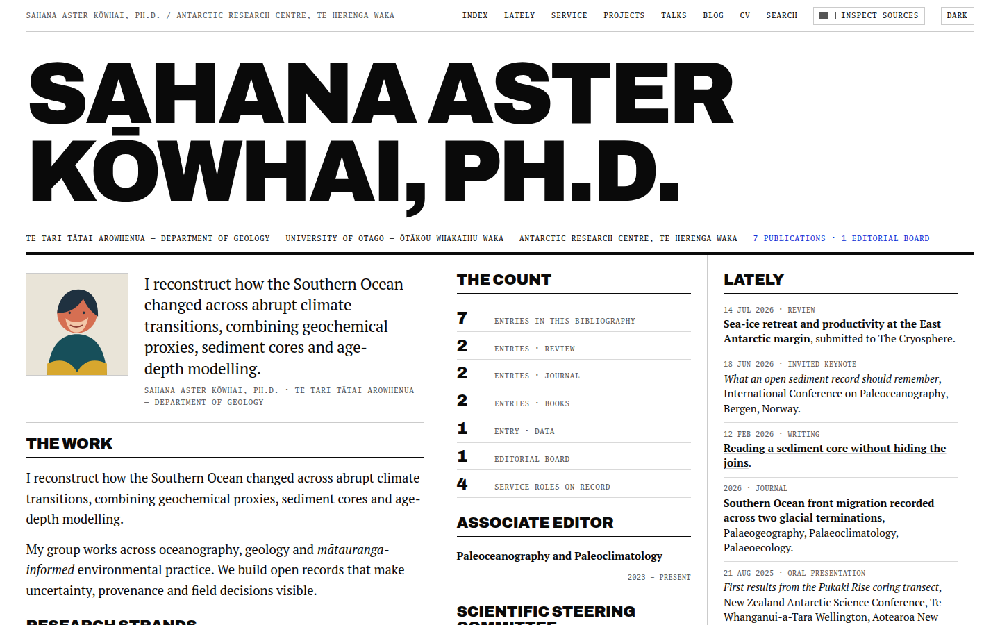
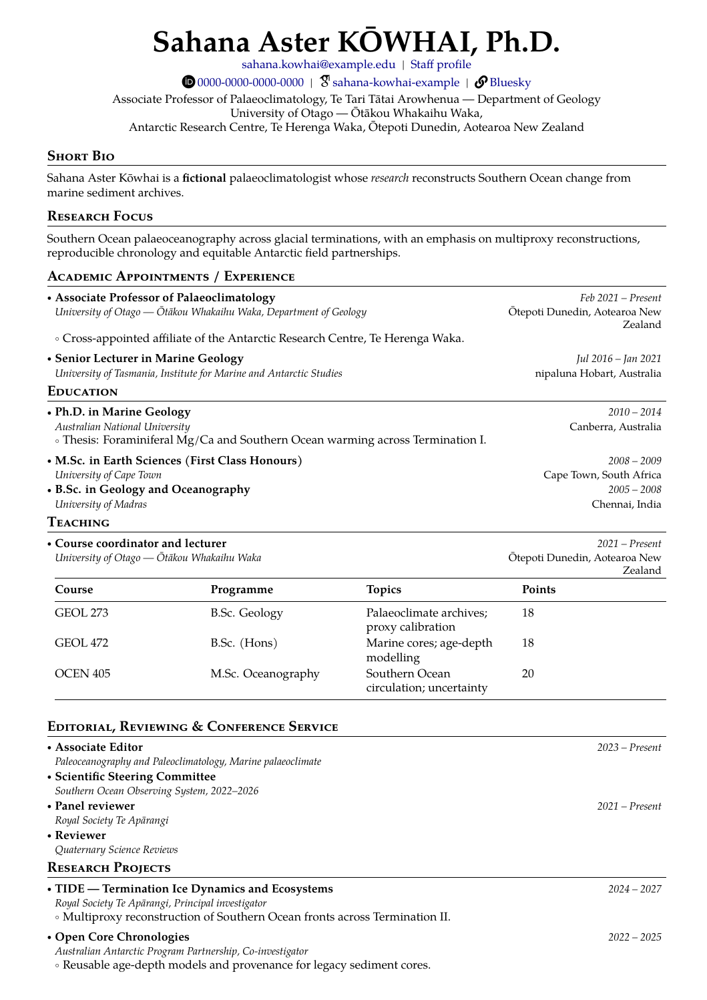
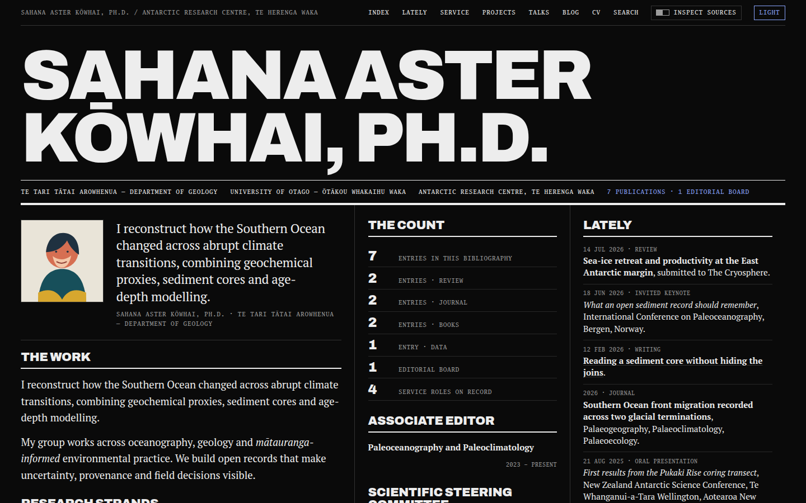
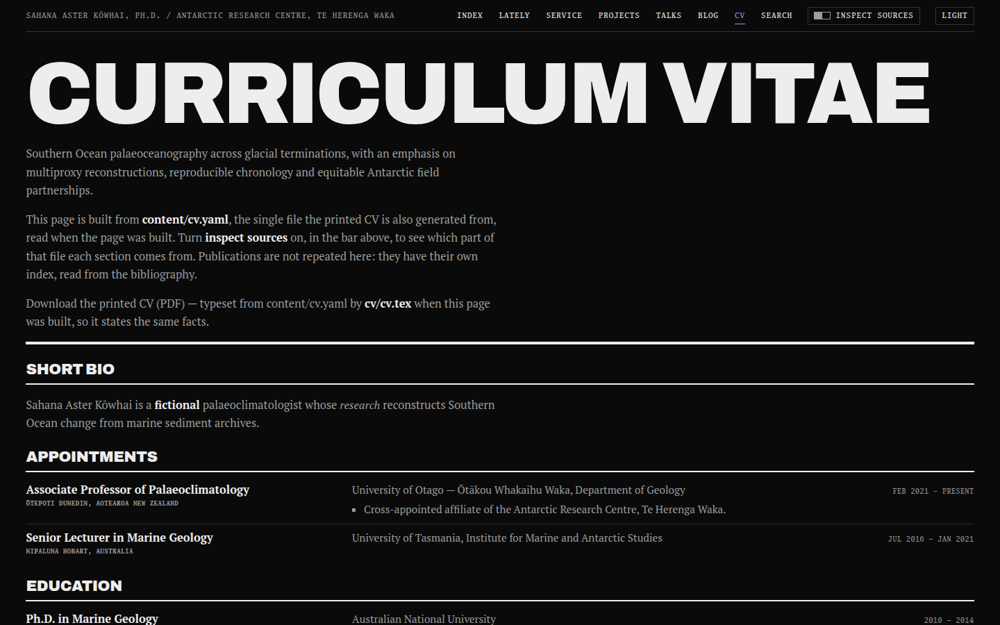

# Your CV and your website, from one file, that cannot disagree.

[](https://github.com/eduardstan/ledgerpress/actions/workflows/cv.yml)
[](https://github.com/eduardstan/ledgerpress/actions/workflows/deploy.yml)
[](https://github.com/eduardstan/ledgerpress/actions/workflows/prettier.yml)
[](https://github.com/eduardstan/ledgerpress/blob/main/LICENSE)
[](https://eduardstan.github.io/ledgerpress/)

ledgerpress turns one academic record into a searchable website and a typeset PDF CV. Drop in the
BibTeX you already have, write your record in `content/`, and every publication, date, count, feed
item and source note is rebuilt from the same facts.

**[See the working example →](https://eduardstan.github.io/ledgerpress/)**

<table>
  <tr>
    <th>Website</th>
    <th>Printed PDF</th>
  </tr>
  <tr>
    <td width="62%">
      <a href="https://eduardstan.github.io/ledgerpress/">
        
      </a>
    </td>
    <td width="38%">
      <a href="https://eduardstan.github.io/ledgerpress/assets/cv.pdf">
        
      </a>
    </td>
  </tr>
</table>

One record publishes both. Change a fact once; the website and PDF change together.

<details>
  <summary>See the dark theme and the website's record-derived CV page</summary>
  <table>
    <tr>
      <td width="50%">
        
      </td>
      <td width="50%">
        
      </td>
    </tr>
  </table>
</details>

**`content/` owns your record — every fact about you, and which sections your CV prints.** Replacing
the example with your own material is a `content/` job and nothing else. Changing the **design** —
colours and type, the printed CV's layout, website routes, redirects, announcement wording — is a
code edit, and it is normal, supported and documented in
[Make it yours](#make-it-yours-after-the-first-green-build). That is the whole line: what you are
lives in `content/`, how it looks lives in code.

## Positioning

[al-folio](https://github.com/alshedivat/al-folio) is a feature-rich academic site theme. It can
render a CV page from either RenderCV or JSONResume data and can optionally generate a PDF from the
RenderCV record. [Academic Pages](https://github.com/academicpages/academicpages.github.io) is a
Markdown-first portfolio template. In both, facts can live in several site and CV inputs; neither
template requires one record to drive the whole website and every printed CV.

ledgerpress makes that single-source contract the point: **one record produces the website, the
full printed CV and its variants.** Change a fact once and every output rebuilds from it, so the web
and print versions cannot drift into different copies. The website also exposes source provenance,
and the production build refuses a contradiction when two hand-written dates on the same fact
disagree.

If a flexible blog or portfolio is the priority, al-folio or Academic Pages may be a better fit.
ledgerpress is for researchers who want their website and printed CVs to remain publications of one
authoritative record.

## Why ledgerpress

- **Import wins adoption.** Turn your public ORCID employment and education into reviewable YAML,
  then replace `content/publications.bib` with a Zotero, Mendeley, DBLP or Google Scholar export.
  Journal articles, chapters, books, datasets and other BibTeX types render without transcription.
- **CV variants win the argument.** Facts and layout are separate. A short CV and a teaching CV ship
  alongside the full one, built from the same record - without copying a single appointment or
  publication. Each is one small `.tex` that names sections, orders them and says how many to print.
- **The record balances.** Publication groups are declared once and drive both the website's type
  column and the PDF's headings and numbering.
- **The gaps stay visible.** Missing dates, unmatched publication types and populated sections
  omitted from a page appear in generated provenance instead of being silently invented.
- **It is a real site, not a CV pasted into HTML.** Blog posts, RSS, sitemap, search, dark mode,
  responsive layouts, accessible navigation, social link previews and GitHub Pages deployment are
  included.

The name is literal: a **ledger** is the record kept once and required to balance; the **press**
publishes it. The product is **ledgerpress**. **Ledger** is the design system inside it—the
high-contrast editorial interface in `web/`, including the Ledger Serif type family.

## In the wild

- **[Bundled example](https://eduardstan.github.io/ledgerpress/)**: The template's own fictional
  palaeoclimatologist, Dr. Sahana Aster Kōwhai. Her record exercises cross-appointments, non-ASCII
  names, talks, teaching tables, projects, service, fieldwork kept off the printed CV via
  `printed: false`, a post and a PNG portrait.
- **[eduardstan.github.io](https://eduardstan.github.io/)**: The real personal site and CV from
  which ledgerpress was extracted.

The example record is fictional. Your own record and media remain yours.

## Start in ten minutes

Use GitHub's **Use this template** button, create a repository, then:

```sh
git clone https://github.com/YOUR-NAME/YOUR-REPOSITORY.git
cd YOUR-REPOSITORY
git remote add ledgerpress https://github.com/eduardstan/ledgerpress.git
git fetch ledgerpress
npm ci
npm ci --prefix web
```

Both installs are required: `web/` is a separate npm package with its own `web/package.json`,
`web/package-lock.json` and `web/node_modules`. The root install brings the CV generator's
dependencies; the `--prefix web` install brings Astro and the website's. Running only the first
leaves every website command failing on missing dependencies.

This is the quickest route: GitHub gives the new repository a clean one-commit history rather than
ledgerpress's history. That means its first upstream update must explicitly join unrelated
histories, as documented below. Choose the history-preserving fork or clone route instead if clean
ongoing merges matter more than a fresh history, especially before customising machinery. If
GitHub does not show the button, use that history-preserving route.

You need Node.js 22.12 or newer. Building the PDF locally also needs XeLaTeX, biber and latexmk;
checking it against the included baseline additionally needs Poppler's `pdftotext`/`pdfinfo`. The
GitHub workflows provide all of those tools in CI.

A minimal TeX Live install is not enough. `cv/preamble.tex` loads `fontspec`, `biblatex`, `academicons`,
`fontawesome5`, `eurosym`, `marvosym`, `tcolorbox`, `titlesec`, `enumitem`, `wrapfig` and `lipsum`,
and sets the document in the TeX Gyre Pagella family. On Debian or Ubuntu that is:

```sh
sudo apt-get install texlive-xetex texlive-latex-recommended texlive-latex-extra \
  texlive-fonts-recommended texlive-fonts-extra texlive-bibtex-extra \
  fonts-texgyre latexmk biber poppler-utils
```

With upstream TeX Live or MacTeX, `scheme-full` covers all of it. A smaller scheme needs:

```sh
tlmgr install fontspec biblatex biber academicons fontawesome5 eurosym marvosym \
  tcolorbox titlesec enumitem wrapfig lipsum tex-gyre latexmk
```

A missing `.sty` or an unregistered TeX Gyre Pagella fails the XeLaTeX pass; the log names the file
or the font.

Now replace the example:

1. Edit `content/cv.yaml`.
2. Replace `content/publications.bib` and `content/talks.bib`.
3. Replace `content/posts/` and `content/media/`.
4. Leave everything outside `content/` alone for the first build.

The complete field reference, a smallest working record and BibTeX grouping examples live in
[`content/README.md`](content/README.md).

Run the website:

```sh
npm run dev
```

That forwards to the website package; `npm --prefix web run dev` and `cd web && npm run dev` are the
same command.

Build the PDF:

```sh
npm run build:cv-data
latexmk -xelatex -cd cv/cv.tex
```

Build the production site:

```sh
npm run build
```

The PDF is written to `cv/cv.pdf`. The website is written to `web/dist/`.

## Before you publish: privacy checklist

- Replace the example name, biography, email, affiliations, links and `profile.site`.
- Replace every `.bib` entry; inspect abstracts, file paths, notes and private attachment URLs.
- Delete example posts and media you do not want.
- Use a portrait you own or have permission to publish. Record its licence.
- Decide whether a street address, room number, personal email or phone number should be public.
- Search the repository and the built output for the previous person's name and domain.
  `web/src/lib/fixtures/record/` is the self-checks' own record and is never published; the rest
  should be yours.
- Open all three printed documents and every website route before pushing.
- Run the cold-start proof below.

Do not solve a missing fact by guessing it. Omit the field; ledgerpress is designed to show honest
gaps.

## Validation

These are the checks for **your** record. Every one of them passes on any valid record, so a
failure here is something to fix in `content/`:

```sh
npm run check
```

It starts by regenerating `cv/generated/cv-data.tex` from your `content/cv.yaml`, because the
checks that follow compare that committed file against your record. So `npm run check` **writes**
that one tracked file, and it says so when it runs — if you see it modified afterwards, that is
why, and the change belongs in your next commit.

That runs, in order:

```sh
npm run build:cv-data          # your record, regenerated into cv/generated/cv-data.tex
npm test                       # the readers, the generators, and your record
npm --prefix web run check     # types
npm --prefix web run build     # the site, including the consistency gate
npm run check:deployment-base  # internal URLs under a project-site base
npm run check:adopter          # the cold-start proof
npm run check:format           # Prettier
```

Build the printed documents alongside it, which nothing above does for you. All three are
generated from the same record:

```sh
latexmk -xelatex -cd cv/cv.tex
latexmk -xelatex -cd cv/short.tex
latexmk -xelatex -cd cv/teaching.tex
```

`npm run check:adopter` is the decisive one. It creates a clean tracked-file-only copy, replaces
only `content/` with a second synthetic scholar, and builds both the website and PDF. If that
requires an edit anywhere else, the check fails.

### Maintainer checks

```sh
npm run check:maintainer
```

This compares each built PDF against the baseline recorded for it — one per printed document, all
taken from the **bundled example record** in `data/cv-baseline/`. It exists to catch layout
regressions in `cv/cv.tex`, `cv/short.tex` and `cv/teaching.tex` while that example is still in
`content/`. Once you have replaced the record there is nothing for it to compare against, so it says
so in one line and verifies nothing — it never reports your record as a regression. **Adopters do
not need to run it**; the deploy workflow runs it and it stays quiet after adoption.

To check one document on its own, pass it: `bash scripts/check-cv-baseline.sh cv/short.pdf`.

If you are changing the template itself and the change deliberately moves text or pages, rebuild the
affected baselines and explain why in `data/cv-baseline/README.md`.

## Deploy on GitHub Pages

The deploy workflow builds and validates the website and all three printed documents, stages the
fresh PDFs into the site, and publishes `web/dist/` to the `gh-pages` branch.

The branch must exist before Pages can be pointed at it, so publish first and configure second:

1. Set `profile.site` in `content/cv.yaml` to the exact published URL, including
   `/YOUR-REPOSITORY/` for a GitHub project site.
2. Keep Actions enabled, and push to `main` (or run **Deploy site** from the Actions tab).
3. Wait for **Deploy site** to finish. That run creates the `gh-pages` branch.
4. Open **Settings → Pages**, choose **Deploy from a branch**, and select `gh-pages` and
   `/ (root)`. Before that first run the branch is not in the dropdown.

Every later push republishes without touching the settings again. Pull requests run every build and
gate without publishing.

## Make it yours after the first green build

Every fact stays in `content/`, including which sections your CV prints: add a top-level list to
`content/cv.yaml` and it appears in the PDF, under the heading its key spells out, with no LaTeX
edit. `content/README.md` documents `heading:` and `printed: false` for the two cases where you want
something else.

**Design is code, and changing it is expected.** Each of these is a deliberate edit outside
`content/`, not a leak in the boundary:

- Edit `web/src/styles/global.css` to change Ledger's colours, type and layout.
- Edit `cv/preamble.tex` to change how every printed document looks — spacing, fonts, the setting of
  an entry. Edit `cv/cv.tex` for the curated heading and position of a section the full CV lays out
  by hand.
- Add migration redirects in `web/src/lib/legacy-urls.ts`.
- Change or add website routes in `web/src/pages/`.
- Change announcement wording in the `TEMPLATES` table of `web/src/lib/announcements.ts`.
- Edit or delete the "Built with ledgerpress" credit line in `web/src/components/Footer.astro`.

None of them touches a fact about you, and taking a later ledgerpress update after one of them is a
merge you resolve rather than a conflict with your record.

### CV variants

Three documents ship, all built from the one record:

| File              | Builds to         | Published as              | What it is                                                |
| ----------------- | ----------------- | ------------------------- | --------------------------------------------------------- |
| `cv/cv.tex`       | `cv/cv.pdf`       | `/assets/cv.pdf`          | the full CV, and the primary download on `/cv/`           |
| `cv/short.tex`    | `cv/short.pdf`    | `/assets/cv-short.pdf`    | appointments, education, awards and selected publications |
| `cv/teaching.tex` | `cv/teaching.pdf` | `/assets/cv-teaching.pdf` | teaching and supervision first, appointments truncated    |

The deploy workflow builds and publishes all three; `/cv/` links the full CV first and the two
variants beside it. The published names keep `cv.pdf` where every existing link already points and
prefix each variant with `cv-`, so a downloaded file still says what it is once it has left the site.

```sh
latexmk -xelatex -cd cv/short.tex
```

`cv/short.tex` is under a hundred lines, most of them comments, and it repeats no fact. Start a variant of your
own by copying whichever is closer:

```sh
cp cv/short.tex cv/grant.tex
```

Every document opens with `\input{preamble.tex}` and `\input{header.tex}`, so the printed design and
the contact block are written once and shared. A variant differs only in layout, four ways:

- **Drop a section** by not writing its `\cvpart` line.
- **Reorder sections** by reordering those lines.
- **Print only the first few** with `\cvpart`'s optional count: `\cvpart[3]{Appointments}{Appointments}`.
  The count is a page budget belonging to that document, so it lives in the `.tex` and never in
  `content/cv.yaml`.
- **Print a narrower slice of the bibliography** with a `\defbibfilter` in the variant's own preamble,
  matching a keyword you set on the entries in `content/publications.bib`. `cv/short.tex` filters on
  `selected` this way, and prints it with `\cvbibfiltered{<heading>}{<filter>}` rather than
  `\printbibliography`. Use the same macro in your own variant: biblatex prints _nothing_ for a filter
  that matches nothing, its heading included, so a raw `\printbibliography` under your own `\section`
  would leave a title with silence beneath it. `\cvbibfiltered` prints one line naming the filter
  instead — nothing yet marked `selected` is a valid record, not a broken build.

That last one is deliberate and worth knowing: do **not** add a "Selected publications" section under
`publications:` in `content/cv.yaml` to get it. That list is one ordering shared by the full CV and the
website, and each section subtracts the ones before it so an entry prints under exactly one heading —
so a `selected` section there would take those papers _out_ of "Journal articles" in `cv.pdf` and out
of their type on the website. A filter only one document uses belongs to that document.

One difference is not a layout choice but a definition: only `cv/cv.tex` ends with
`\cvAutoSections`, the record's own section sequence. That is what makes a new section in
`content/cv.yaml` appear in the full CV with no LaTeX edit. A variant is a curated subset, so
printing every section it did not name is the one thing it exists not to do — add the section's
`\cvpart` line when you want it there. `printed: false` still wins everywhere: a variant reaches
every section through `\cvpart`, which honours it.

For prose a variant needs and the full CV does not — a teaching statement in place of the research
focus — add a top-level section with a `note:` and no entries; see `teaching_statement:` in
`content/cv.yaml`. `profile:` itself is a fixed set of fields.

Add a variant to CI by adding its file to `root_file:` in **both** `.github/workflows/cv.yml` and
`.github/workflows/deploy.yml`, staging it in the deploy workflow, adding its conditional link in
`web/src/pages/cv.astro`, and recording a baseline for it; `data/cv-baseline/README.md` has the two
commands. The two workflows must name the same set — one builds for review, the other is the only
one that publishes — and `npm test` fails when they disagree.

## Take later ledgerpress improvements

Keep ledgerpress as a read-only second remote in your personal site. Template improvements flow in;
personal data never flows out. Choose one route and keep it: the template route starts fastest but
has one unrelated-history update; a fork or history-preserving clone keeps ancestry and makes every
update an ordinary merge.

### If you used **Use this template**

The setup above already added the remote. For the first update, join the two histories, take the
upstream machinery side of their initial add/add conflicts, and then restore your record before
committing:

```sh
git switch main
git pull --ff-only
git fetch ledgerpress
git merge --allow-unrelated-histories --no-commit --no-ff -X theirs ledgerpress/main
git restore --source=HEAD --staged --worktree content/
git diff --check
git diff --stat HEAD
git commit -m "chore: connect ledgerpress updates"
npm ci
npm ci --prefix web
npm run check
```

`-X theirs` is deliberate only for this first unrelated merge: it takes ledgerpress's current
machinery while the following `git restore` keeps your `content/`. Review the remaining diff before
committing; if you have already customised machinery, use the history-preserving route below or
resolve those files by hand.

If you recorded the ledgerpress commit used to create your template, you may take only later
upstream commits instead of joining histories. Replace the two values below with that recorded
commit and the last commit you want, then run:

```sh
LEDGERPRESS_BASE=<RECORDED-TEMPLATE-COMMIT>
LEDGERPRESS_LAST=<LAST-UPSTREAM-COMMIT>
git fetch ledgerpress
git cherry-pick --no-commit "$LEDGERPRESS_BASE".."$LEDGERPRESS_LAST"
git restore --source=HEAD --staged --worktree content/
git diff --check
git commit -m "chore: take ledgerpress improvements"
```

That cherry-pick route deliberately does not create shared ancestry. Record the new last commit and
repeat from it next time.

After the first unrelated merge, every later update uses the ordinary merge recipe in the next
section.

### If you want history-preserving updates

Either fork ledgerpress on GitHub and clone your fork:

```sh
git clone https://github.com/YOUR-NAME/YOUR-FORK.git YOUR-REPOSITORY
cd YOUR-REPOSITORY
git remote add ledgerpress https://github.com/eduardstan/ledgerpress.git
git fetch ledgerpress
```

Or create an empty repository of your own, then preserve ledgerpress's history while assigning the
two remotes explicitly:

```sh
git clone https://github.com/eduardstan/ledgerpress.git YOUR-REPOSITORY
cd YOUR-REPOSITORY
git remote rename origin ledgerpress
git remote add origin https://github.com/YOUR-NAME/YOUR-REPOSITORY.git
git push -u origin main
```

Replace only `content/`, commit it to your own `origin`, and use this recipe for every update (and
for every template-route update after its first merge):

```sh
git switch main
git pull --ff-only
git fetch ledgerpress
git merge --no-commit --no-ff ledgerpress/main
git restore --source=HEAD --staged --worktree content/
git diff --check
git diff --stat HEAD
git commit -m "chore: take ledgerpress improvements"
npm ci
npm ci --prefix web
npm run check
```

The `git restore` line deliberately puts your current `content/` back before the merge commit. Read
the remaining diff: it should be machinery only. Resolve any non-content conflict, rebuild both
outputs, then push to your own remote. Never push your personal branch to the `ledgerpress` remote.

## How it works

```text
content/cv.yaml ───────┬──> Astro readers ──> website, search, RSS, provenance
                       └──> CV generator ───> generated LaTeX ──> PDF

content/publications.bib ──> publication index + announcement register + PDF groups
content/talks.bib ─────────> talks page + announcement register + PDF groups
content/posts/ ────────────> blog + announcement register + RSS
```

The important contracts are kept executable:

- the generator rejects stale generated data and malformed table rows;
- tests prove website and biber grouping agree, first match wins, and empty bibliographies stay safe;
- the consistency gate compares duplicate dates within the same record;
- a test proves a section invented in the record joins the printed CV with no `.tex` edit;
- the adopter check proves a new person does not inherit the example;
- the baseline gate protects the printed result, not byte-identical build artefacts.

## Roadmap

- The ORCID importer covers public employment, education and qualifications. Importing ORCID works
  is deliberately not on this list: your BibTeX export is the more complete source.
- An existing LaTeX or PDF CV can realistically be transcribed by giving it and
  `content/README.md` to an assistant, then reviewing every resulting fact. That is not a supported
  import route yet: a generative step sits between source facts and a public claim, so ledgerpress
  ships no official prompt or verification checklist and promises no automatic accuracy.

## Licence

The machinery is MIT licensed; see [`LICENSE`](LICENSE). Bundled web fonts retain their own licences
in [`web/public/fonts/LICENSES.md`](web/public/fonts/LICENSES.md).
